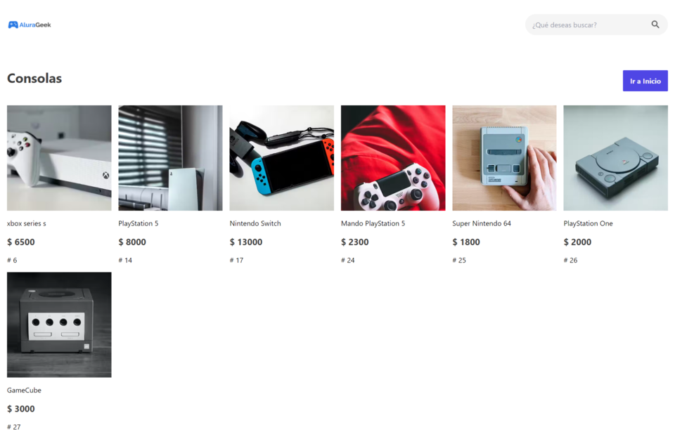

# AluraGeek

AluraGeek Ecommerce es una aplicación web de comercio electrónico que permite a los usuarios comprar una variedad de productos en línea. Esta plataforma proporciona a los clientes una experiencia de compra fácil y segura.

## Tabla de Contenidos

- [Tecnologías Utilizadas](#tecnologías-utilizadas)
- [Funcionalidad](#Funcionalidad-v1)
- [Requisitos Previos](#Próximas-funcionalidaes)
- [Detalle Aplicación](#Detalle-de-aplicación)

## Tecnologías Utilizadas

- Vanilla Javascript
- TailwindCss
- HTML
- SessionStorage
- Json Server
- Vite
- GitHub Pages
- Render Web service

## Funcionalidad v1

- Inicio de Sesión con email: correo@correo.com password: 12345678
- Validaciones en los formularios
- Búsqueda y navegación de productos en la página principal por medio del nombre del producto
- Visualización de productos por categoría.
- Descripción de un producto seleccionado.
- Menu de administración para crear, eliminar y editar productos (CRUD).
- Rutas protegidas si no ha iniciado sesión
- Simulación de API con un servicio web de json-server en render.com

## Próximas funcionalidaes

Para versiones posteriores, se tiene en mente desarrollar otras funcionalidades, por ejemplo:

- Registro de nuevos usuarios
- Busqueda de productos en todas las diferentes rutas de la aplicación
- Carrito de compras
- Subida de imágenes y edición por medio de un servicio web.
- Migración hacia react para el frontend y node js para la api

## Detalle de aplicación

Cuando se accede a la url del proyecto, se encuentra la página principal con los productos separados por categoría:

Al dar click sobre **ver todos** de una categoría, se pueden visualizar todos los productos agrupados por categoría, ver siguiente imágen:

Igualmente, al dar click sobre el link **ver producto** se puede acceder al detalle del mismo de manera independiente.

Hasta este punto, si se desea entrar en el panel de administación, se debe hacer inicio de sesión debido a que la ruta es protegida.

> Utilizar el **email: correo@correo.com** y el **password: 12345678** para poder acceder al panel de administración

Una vez iniciada la sesión, se muestran los productos del ecommerce y la opcion editar, eliminar y crear nuevos productos.

Así, al ir a inicio, la página ahora de mostrar **login**, mostrará un enlace para el panel de administración y un enlace para cerrar la sesión, ver imágen:

Adicionalmente, se tiene la barra de búsqueda en página principal (solo página principal por el momento) por nombre del producto y al hacer click se navega a la descripción del producto buscado.

